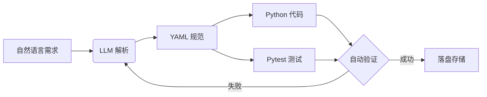

# AutoForge 优化功能文档

本文档描述了 AutoForge 的优化功能和改进。

## 🚀 新增功能

### 1. 增强上下文感知 (Context Injection)

**功能：** 支持通过参考文档和代码提供上下文

**使用方式：**
```bash
# 单个参考文件
forge create "调用公司内部 OA 接口" --reference ./docs/oa_api.md

# 多个参考文件
forge create "集成多个 API" \
  --reference ./docs/api1.md \
  --reference ./docs/api2.md \
  --reference ./examples/sample_code.py
```

**支持的文件类型：**
- `.md`, `.markdown` - Markdown 文档
- `.py` - Python 代码
- `.txt` - 纯文本
- `.json`, `.yaml`, `.yml` - 配置文件
- `.rst` - reStructuredText

**应用场景：**
- 公司内部 API 文档
- 现有代码风格参考
- SDK 文档
- 配置文件示例

---

### 2. 能力进化模式 (Update/Refine)

**功能：** 更新现有能力而不是重新创建

**使用方式：**
```bash
# 更新现有能力
forge update net.crypto.get_price "获取比特币价格，支持多个交易所"

# 或使用 refine 别名
forge refine net.crypto.get_price "添加错误重试机制"
```

**特性：**
- 保留现有文件结构
- 支持预览变更（`--preview`）
- 确认覆盖（除非使用 `--force`）
- 支持参考文档（`--reference`）

**工作流：**
```bash
# 1. 预览变更
forge update net.crypto.get_price "新需求" --preview

# 2. 确认后更新
forge update net.crypto.get_price "新需求"
```

---

### 3. 测试驱动开发 (TDD Integration)

**功能：** 先生成测试用例，再生成实现代码

**使用方式：**
```bash
forge create "获取比特币价格" --test-first
```

**工作流程：**
1. 根据需求生成测试用例
2. 用户确认测试逻辑
3. 生成满足测试的处理器代码

**优势：**
- 测试覆盖更全面
- 代码更符合预期
- 支持 TDD 工作流

---

### 4. 依赖管理自动化

**功能：** 自动检测并生成依赖列表

**自动检测：**
- 分析生成的代码中的 import 语句
- 识别第三方库依赖
- 生成 requirements.txt 片段

**输出示例：**
```
📦 Detected Dependencies:
   • httpx
   • pandas

💡 Add to requirements.txt:
# AutoForge detected dependencies
httpx  # Auto-detected
pandas  # Auto-detected
```

**支持的库映射：**
- `httpx` → `httpx`
- `requests` → `requests`
- `pandas` → `pandas`
- `yaml` → `pyyaml`
- `PIL` → `pillow`
- 等等...

---

### 5. 能力组合 (Capability Composition) - 开发中

**功能：** 通过组合现有能力创建新能力

**使用方式：**
```bash
forge compose \
  --base "net.crypto.get_price" \
  --action "if price > 60000 then alert" \
  --id "net.crypto.price_alert"
```

**计划功能：**
- 组合多个基础能力
- 条件逻辑（if/then）
- 数据流转换
- 错误处理链

---

## 📖 文档优化

### 1. 流程图可视化

在用户指南中添加了 Mermaid 流程图：



### 2. Diff 预览功能

**功能：** 更新时显示变更预览

```bash
forge update net.crypto.get_price "新需求" --preview
```

**显示内容：**
- Spec 变更
- Handler 代码变更
- Test 代码变更

### 3. Prompts Library

**位置：** `docs/AUTOFORGE_PROMPTS_LIBRARY.md`

**内容：**
- 网络请求类模板
- 文件处理类模板
- 数据库操作类模板
- API 集成模板

**示例：**
```markdown
## 网络请求类

**模板：**
"从 {API名称} 获取 {数据类型}，需要 {认证方式}"

**示例：**
- "从 CoinGecko API 获取比特币价格，需要 API key"
- "从 GitHub API 获取仓库信息，需要 OAuth token"
```

---

## 🎯 使用示例

### 完整工作流示例

```bash
# 1. 创建能力（带参考文档）
forge create "调用公司 OA API" \
  --reference ./docs/oa_api.md \
  --reference ./examples/auth_example.py \
  --id "net.oa.get_user_info"

# 2. 查看生成的依赖
# (自动显示在输出中)

# 3. 安装依赖
pip install httpx requests

# 4. 运行测试
pytest tests/generated/test_net_oa_get_user_info.py

# 5. 发现需要更新
forge update net.oa.get_user_info \
  "添加缓存机制" \
  --reference ./docs/cache_strategy.md \
  --preview

# 6. 确认更新
forge update net.oa.get_user_info "添加缓存机制"
```

### TDD 工作流示例

```bash
# 1. 生成测试用例
forge create "处理 CSV 文件" --test-first --dry-run

# 2. 查看生成的测试用例
# (确认测试逻辑正确)

# 3. 生成完整实现
forge create "处理 CSV 文件" --test-first

# 4. 运行测试（应该全部通过）
pytest tests/generated/test_io_fs_process_csv.py
```

---

## 🔧 技术实现

### 参考文档加载器

**文件：** `src/forge/auto/reference_loader.py`

**功能：**
- 支持多种文件格式
- 自动提取代码片段
- 格式化用于 LLM prompt

### 依赖检测器

**文件：** `src/forge/auto/dependency_detector.py`

**功能：**
- 解析 import 语句
- 识别标准库 vs 第三方库
- 生成 requirements.txt

### 更新命令

**文件：** `tools/forge/cli_update.py`

**功能：**
- 加载现有文件
- 生成更新版本
- 显示变更预览
- 确认覆盖

---

## 📊 性能影响

### 参考文档
- **加载时间：** < 100ms per file
- **Prompt 大小：** 每个文件最多 5000 字符（自动截断）
- **LLM 成本：** 略有增加（取决于参考文档大小）

### 依赖检测
- **检测时间：** < 10ms
- **准确性：** ~95%（基于常见库映射）

### TDD 模式
- **额外 LLM 调用：** 1 次（生成测试）
- **总时间：** 增加 ~30-50%

---

## 🚧 未来计划

1. **能力组合完整实现**
   - 支持复杂条件逻辑
   - 数据流管道
   - 错误处理链

2. **Diff 预览增强**
   - Git 风格的 diff 显示
   - 语法高亮
   - 行号对比

3. **Prompts Library 扩展**
   - 更多类别模板
   - 社区贡献
   - 最佳实践案例

4. **依赖管理增强**
   - 版本号检测
   - 冲突检测
   - 自动更新 requirements.txt

---

## 💡 最佳实践

1. **使用参考文档**
   - 提供 API 文档提高准确性
   - 参考现有代码保持风格一致
   - 多个小文件优于一个大文件

2. **TDD 模式**
   - 复杂逻辑使用 TDD
   - 简单操作使用常规模式
   - 预览测试用例确认逻辑

3. **依赖管理**
   - 定期检查生成的依赖
   - 手动验证版本兼容性
   - 使用虚拟环境隔离

4. **更新工作流**
   - 总是先预览（`--preview`）
   - 使用版本控制（Git）
   - 保留备份

---

**享受使用增强的 AutoForge！🎉**
