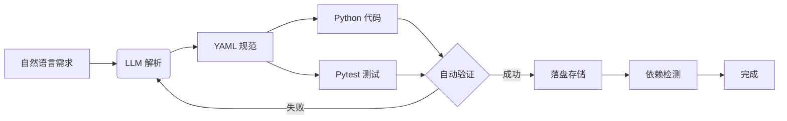

# AutoForge 用户指南

## 🎯 什么是 AutoForge？

AutoForge 是一个**自动化能力生成工具**，可以将自然语言需求转换为完整的 AI-First 能力（规范 + 代码 + 测试）。

**核心价值：**
- 🚀 **零代码生成** - 用自然语言描述需求，自动生成完整实现
- ✅ **合规保证** - 自动生成符合 v3 规范的能力定义
- 🔒 **安全优先** - 自动识别风险等级和副作用
- 🧪 **测试就绪** - 自动生成测试代码

## 📊 工作流程



---

## 📖 快速开始

### 1. 基本使用

最简单的使用方式，只需要一句话：

```bash
forge create "获取 CoinGecko 的比特币价格"
```

AutoForge 会自动：
1. 解析你的需求
2. 生成能力规范（YAML）
3. 生成处理器代码（Python）
4. 生成测试代码（pytest）
5. 保存到相应目录

### 2. 查看生成结果

```bash
# 使用 --dry-run 预览，不保存文件
forge create "获取比特币价格" --dry-run

# 使用 --verbose 查看详细过程
forge create "获取比特币价格" --verbose
```

### 3. 指定能力 ID

```bash
forge create "获取比特币价格" --id "net.crypto.get_bitcoin_price"
```

---

## 🎨 用户体验特性

### 1. 智能进度反馈

AutoForge 会在执行过程中显示清晰的进度：

```
🔨 Starting AutoForge pipeline...
   Requirement: 获取 CoinGecko 的比特币价格

📝 Phase 1: Parsing requirement...
   ✓ Extracted action: get_price
   ✓ Extracted target: coingecko
   ✓ Intent category: NETWORK

🔧 Phase 2: Generating specification...
   ✓ Risk level: LOW
   ✓ Operation type: NETWORK
   ✓ Side effects: network_read

✅ Phase 3: Validating specification...
   ✓ All validations passed

💻 Phase 4: Generating handler code...
   ✓ Handler code generated (1,234 chars)

🧪 Phase 5: Generating test code...
   ✓ Test code generated (2,345 chars)

✅ Capability forged successfully!
```

### 2. 清晰的错误提示

当出现错误时，AutoForge 会提供：
- **错误类型** - 是什么问题
- **错误位置** - 在哪一步出错
- **解决建议** - 如何修复

```bash
❌ Error: Failed to generate valid spec after 3 attempts

Issues:
  1. Missing undo strategy for write operation
  2. Risk level mismatch: DELETE operations require HIGH risk

💡 Suggestions:
  - Try rephrasing your requirement to be more specific
  - Use --verbose to see detailed LLM responses
  - Check if your requirement involves destructive operations
```

### 3. 交互式确认（即将推出）

对于高风险操作，AutoForge 会询问确认：

```
⚠️  High-Risk Operation Detected

Your requirement involves:
  - DELETE operation
  - Irreversible side effects
  - Risk level: HIGH

Proceed with generation? [y/N]: 
```

---

## 📚 使用场景

### 场景 1: 快速原型开发

**需求：** 快速创建一个新的 API 集成能力

```bash
forge create "从 Slack API 发送消息到指定频道" \
  --id "net.slack.send_message" \
  --verbose
```

**输出：**
- `capabilities/validated/generated/net.slack.send_message.yaml`
- `src/runtime/stdlib/generated/net_slack_send_message.py`
- `tests/generated/test_net_slack_send_message.py`

### 场景 2: 批量生成能力

**需求：** 为多个 API 端点生成能力

```bash
# 生成多个能力
forge create "获取 GitHub 仓库信息" --id "net.github.get_repo"
forge create "创建 GitHub Issue" --id "net.github.create_issue"
forge create "更新 GitHub Issue" --id "net.github.update_issue"
```

### 场景 3: 学习和探索

**需求：** 了解如何创建特定类型的能力

```bash
# 使用 --dry-run 查看生成的内容
forge create "读取本地文件" --dry-run

# 查看生成的规范结构
forge create "写入本地文件" --dry-run | grep -A 20 "spec:"
```

---

## 🎯 最佳实践

### 1. 需求描述要具体

**❌ 不好的描述：**
```bash
forge create "处理数据"
```

**✅ 好的描述：**
```bash
forge create "从 CSV 文件读取数据并转换为 JSON 格式"
```

### 2. 明确指定能力 ID

**❌ 自动生成可能不符合预期：**
```bash
forge create "发送邮件"
# 可能生成: net.email.send 或 net.mail.send
```

**✅ 明确指定：**
```bash
forge create "发送邮件" --id "net.smtp.send_email"
```

### 3. 使用上下文信息

对于需要额外信息的场景，使用 `--context`：

```bash
forge create "发送 Slack 消息" \
  --context '{"workspace": "my-workspace", "default_channel": "#general"}'
```

### 4. 先预览再保存

**工作流：**
```bash
# 1. 先预览
forge create "你的需求" --dry-run

# 2. 确认无误后保存
forge create "你的需求"
```

---

## 🔧 高级用法

### 1. 自定义模型

使用不同的 LLM 模型：

```bash
forge create "复杂需求" --model "gpt-4" --retries 5
```

### 2. 详细调试

查看完整的生成过程：

```bash
forge create "你的需求" --verbose
```

这会显示：
- LLM 的原始响应
- 每个阶段的中间结果
- 验证过程的详细信息

### 3. 工作空间管理

指定不同的工作空间：

```bash
forge create "你的需求" --workspace ./my-project
```

---

## 🐛 故障排除

### 问题 1: API 密钥未设置

**错误：**
```
❌ Error: The api_key client option must be set
```

**解决：**
```bash
export OPENAI_API_KEY=your_key_here
forge create "你的需求"
```

### 问题 2: 生成的内容不符合预期

**解决步骤：**
1. 使用 `--verbose` 查看详细过程
2. 检查需求描述是否足够具体
3. 尝试重新表述需求
4. 使用 `--dry-run` 多次尝试

### 问题 3: 验证失败

**错误：**
```
❌ Error: Failed to generate valid spec after 3 attempts
```

**解决：**
- 检查需求是否涉及高风险操作（DELETE、不可逆操作）
- 尝试将复杂需求拆分为多个简单需求
- 使用 `--retries 5` 增加重试次数

---

## 📊 生成的文件结构

```
项目根目录/
├── capabilities/
│   └── validated/
│       └── generated/
│           └── {capability_id}.yaml      # 能力规范
├── src/
│   └── runtime/
│       └── stdlib/
│           └── generated/
│               └── {capability_id}.py  # 处理器代码
└── tests/
    └── generated/
        └── test_{capability_id}.py     # 测试代码
```

---

## 🚀 下一步

生成能力后：

1. **运行测试**
   ```bash
   pytest tests/generated/test_{capability_id}.py
   ```

2. **审查代码**
   - 检查生成的处理器代码
   - 根据需要调整实现
   - 添加额外的错误处理

3. **提交到 Git**
   ```bash
   git add capabilities/validated/generated/{capability_id}.yaml
   git add src/runtime/stdlib/generated/{capability_id}.py
   git add tests/generated/test_{capability_id}.py
   git commit -m "feat: add {capability_id} capability"
   ```

---

## 💡 提示

- **使用 Tab 补全** - 如果使用支持补全的 shell，可以自动补全命令
- **保存常用命令** - 将常用命令保存为脚本或别名
- **查看帮助** - `forge create --help` 查看所有选项

---

## 🤝 反馈

如果遇到问题或有改进建议，请：
1. 使用 `--verbose` 收集详细信息
2. 提交 Issue 或 Pull Request
3. 查看 [贡献指南](CONTRIBUTING.md)

---

**享受使用 AutoForge！🎉**
